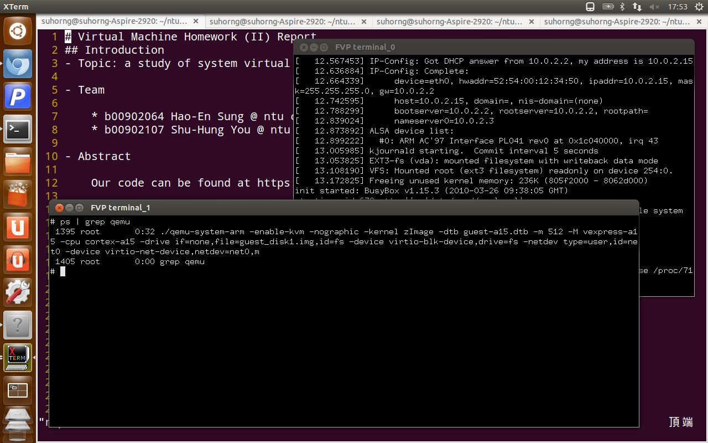
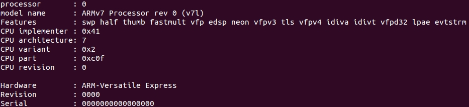
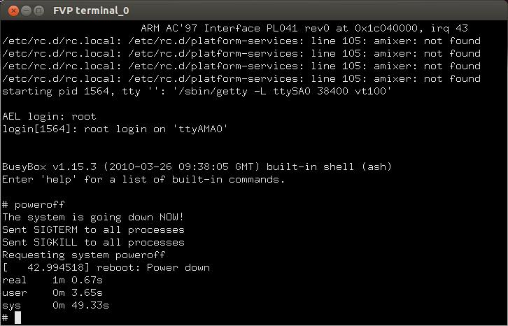
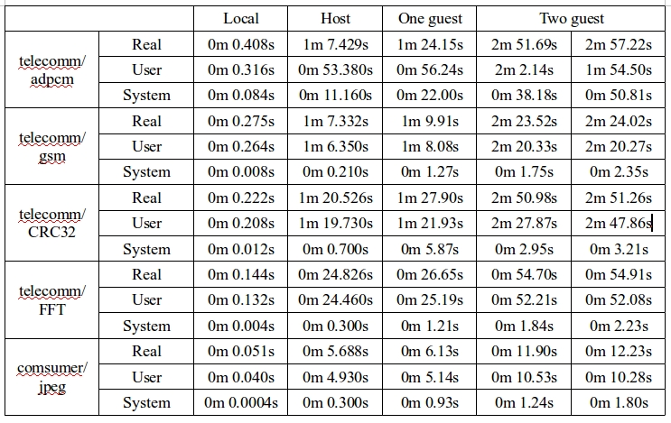

# Virtual Machine Homework (II) Report
## Introduction
- Topic: a study of system virtual machine

- Team

    * b00902064 Hao-En Sung @ ntu csie
    * b00902107 Shu-Hung You @ ntu csie

- Abstract

    Our code can be found at https://github.com/suhorng/vm14hw2

    > We study the same ISA system virtual machine on a simulated ARM Cortex A15x1
    platform. We build one host VM which runs one or more guest VMs, trace the hypervisor
    traps in the **kvm** module. We also run serveral benchmarks on multiple guest VMs
    to observe the loadings.



## Part I - Trap Profiling

In this experiment, we traced several events in the KVM to see how many traps are there.
We mainly focused on the HVC exception in the hypervisor mode and observed an unexpected
result.

### Virtual Machine Setup Difficulties

1. We chose to use the MMC file system instead of the NFS since there is little setup
required to use a disk image, and its construction is similar to the guest machine.
However, we initially only gave the host machine a 512MB disk, and was unable to put the 
guest inside the host for it was too large. Later we rebuild a host with enough disk space.

1. The given `qemu-system-arm` startup command was wrong. The given one was

    ```shell
    #!/bin/sh
    ./qemu-system-arm \
        -enable-kvm \
        -nographic \
        -kernel zImage \
        -dtb guest-a15.dtb \
        -m 512 -M vexpress-a15 -cpu cortex-a15 \
        -drive if=none,file=guest_disk.img,id=fs \
        -device virtio-blk-device,drive=fs \
        -netdev type=user,id=net0 \
        -device virtio-net-device,netdev=net0,mac="52:54:00:12:34:50" \
        -append "console=ttyAMA0 mem=512 root=/dev/vda ip=dhcp"
    ```

    But the `mem=512` parameter should be `mem=512M`. If not, our guest would not have
    enough memory to run.

After booting up the host/guest virtual machine, we checked for its `cpuinfo` and
happliy found that our virtual machines are indeed working.



### The KVM Architecture Overview

XXX TODO insert KVM architecture graph here

As depicted in the graph, the KVM is a kernel module running inside the host VM that
helps the guest VM to virtualize the CPU. For the I/O part, guest-issued I/O requests
will be forwared to the QEMU emulation system.

After entering the hypervisor mode of the ARM processor, the KVM kernel module can
fully realize its potential in simplifying and speeding up the CPU virtualization.
The interface of the KVM kernel module to the outside world is, as usual, via the
`ioctl` function. The handler `kvm_vm_ioctl` and `kvm_vcpu_ioctl` are at
`virt/kvm/kvm_main.c` with architecture-dependent functionalities be forwarded to,
say, `kvm_arch_vcpu_ioctl1` in `arch/arm/kvm/arm.c`.

It mainly has the following instructions:

1. Create a virtual CPU

    ```cpp
    static long kvm_vm_ioctl(/* ... */) {
      /* ... */
      switch (ioctl) {
      case KVM_CREATE_VCPU:
        r = kvm_vm_ioctl_create_vcpu(kvm, arg);
        break;
        /* ... */

    static int kvm_vm_ioctl_create_vcpu(/* ... */) {
      /* ... */
      vcpu = kvm_arch_vcpu_create(kvm, id);
      /* ... */
      r = kvm_arch_vcpu_setup(vcpu);
      /* ... */

    struct kvm_vcpu *kvm_arch_vcpu_create(/* ... */) {
      int err; struct kvm_vcpu *vcpu;
      vcpu = kmem_cache_zalloc(kvm_vcpu_cache, GFP_KERNEL);
      /* ... */
      err = kvm_vcpu_init(vcpu, kvm, id);
      /* ... */
    ```

1. Run on a virtual CPU

    ```cpp
    static long kvm_vcpu_ioctl(/* ... */) {
      /* ... */
      switch (ioctl) {
      case KVM_RUN:
        r = -EINVAL;
        if (arg)
          goto out;
        r = kvm_arch_vcpu_ioctl_run(vcpu, vcpu->run);
        trace_kvm_userspace_exit(vcpu->run->exit_reason, r);
        break;
        /* ... */

    int kvm_arch_vcpu_ioctl_run(/* ... */) {
      /* our main modifications here! */
      /* ... *virtualize* the cpu; enter guest mode and execute! */
    ```

1. Get/set virtual CPU register
1. Initialize a ARM CPU from use request

    ```cpp
    long kvm_arch_vcpu_ioctl(/* ... */) {
      /* ... */
      switch (ioctl) {
      case KVM_ARM_VCPU_INIT: {
        /* ... */
    ```

To use CPU virtualization, we shall more or less go through the above two
instructions.

### Implementation

Our implementation made two changes to the KVM, and we simply utilized other existing
tracing points to make our observation. The first one was to add an *exit count* to the
original `kvm_exit` trace event. `kvm_exit` traces when the processor leaves non-
hypervisor mode and back to the KVM run loop:

```cpp
 int kvm_arch_vcpu_ioctl_run(/* ... */) {
   /* ... */
   while (ret > 0) {
     /* ... */
     local_irq_disable();
     /* ... */
     trace_kvm_entry(*vcpu_pc(vcpu));
     kvm_guest_enter();
     vcpu->mode = IN_GUEST_MODE;

     ret = kvm_call_hyp(__kvm_vcpu_run, vcpu);

     vcpu->mode = OUTSIDE_GUEST_MODE;
     vcpu->arch.last_pcpu = smp_processor_id();
     kvm_guest_exit();
-    trace_kvm_exit(*vcpu_pc(vcpu));
+    ++vcpu->cnt_exit;
+    trace_kvm_exit(*vcpu_pc(vcpu), vcpu->cnt_exit);
     /* ... */
```

Then we modified the `kvm_exit` trace-event in `arch/arm/kvm/trace.h` to print exit
count. The second one was to add our own trace event to record the HVC trap count, which
is the hypervisor trap in ARM hypervisor mode. According to the ARM architecture
reference manual, this exception happens whenever an `HVC` instruction is issued
(i.e. the guest requested to switch to hypervisor mode. This might happen in a
`virtio` defice) or when some exceptions was routed to the hypervisor.

1. Add our trace event in `arch/arm/kvm/trace.h`

    ```cpp
    /* tracing exception file */
    TRACE_EVENT(kvm_exchvc,
      TP_PROTO(unsigned long vcpu_pc, int cnt_exchvc, int kvm_cond_valid),
      TP_ARGS(vcpu_pc, cnt_exchvc, kvm_cond_valid),

      TP_STRUCT__entry(
        __field(unsigned long, vcpu_pc)
        __field(int, cnt_exchvc)
        __field(int, kvm_cond_valid)
      ),

      TP_fast_assign(
        __entry->vcpu_pc = vcpu_pc;
        __entry->cnt_exchvc = cnt_exchvc;
        __entry->kvm_cond_valid = kvm_cond_valid;
      ),

      TP_printk("PC: 0x%08lx; trap count: %d; kvm_cond_valid: %s",
        __entry->vcpu_pc,
        __entry->cnt_exchvc,
        __entry->kvm_cond_valid? "true" : "false")
    );
    ```

1. Insert out trace events to appropiate points. We figured out that the main loop
    will check for exception upon every exit, i.e.

    ```cpp
    int kvm_arch_vcpu_ioctl_run(/* ... */) {
        /* ... */
        kvm_guest_exit();
        /* ... */
        local_irq_enable();
        /* ... */
        ret = handle_exit(vcpu, run, ret);
      }
    ```

    Hence we could safely insert our trace point in exception dispatching function:

    ```cpp
     int handle_exit(/* ... */) {
       exit_handle_fn exit_handler;

       switch (exception_index) {
       /* ... */
       case ARM_EXCEPTION_HVC:
         if (!kvm_condition_valid(vcpu)) {
     +     ++vcpu->cnt_exchvc;
     +     trace_kvm_exchvc(*vcpu_pc(vcpu), vcpu->cnt_exchvc, 0);
           kvm_skip_instr(vcpu, kvm_vcpu_trap_il_is32bit(vcpu));
           return 1;
         }

     +   ++vcpu->cnt_exchvc;
     +   trace_kvm_exchvc(*vcpu_pc(vcpu), vcpu->cnt_exchvc, 1);
         exit_handler = kvm_get_exit_handler(vcpu);

         return exit_handler(vcpu, run);
    ```

1. And the last step was to turn on our trace event.

To record the exit count and the HVC trap count, we added two additional counters in
the `kvm_vcpu` structure defined in `include/linux/kvm_host.h`:

```cpp
 struct kvm_vcpu {
   /* ... */
 #endif
 	 bool preempted;
 	 struct kvm_vcpu_arch arch;

+  int cnt_exchvc;
+  int cnt_exit;
 };
```

Upon tracing the code, we actually found a trace event `trace_kvm_hvc` in the HVC
handleing function, `handle_hvc`. That was, we actually didn't really need to create
a brand new trace event. Anyway, we did it for fun.

### Trace Result

The result was interesting. Since traps to the hypervisor mode is non-stopping, we
cannot count the exact number of traps during guest boot-up. We hence counts the
trap number of guest boot-up followed by an immediate `poweroff`.

The result count is as follows.

```
179.182896: kvm_entry:  PC: 0x802c1f24
179.183041: kvm_exit:   PC: 0x802c21c8; exit count: 80671
179.183096: kvm_exchvc: PC: 0x802c21c8; trap count: 74322; kvm_cond_valid: true
179.183120: kvm_guest_fault: ipa 0x1c010000, hsr 0x93800006, hxfar 0xf80100a8, pc 0x802c21c8
179.183166: kvm_userspace_exit: reason KVM_EXIT_MMIO (6)
179.200710: kvm_userspace_exit: reason restart (4)
```

And running it again turned out to have similar trap counts:

```
181.829151: kvm_entry:  PC: 0x802c1f24
181.829296: kvm_exit:   PC: 0x802c21c8; exit count: 81072
181.829351: kvm_exchvc: PC: 0x802c21c8; trap count: 74382; kvm_cond_valid: true
181.829375: kvm_guest_fault: ipa 0x1c010000, hsr 0x93800006, hxfar 0xf80100a8, pc 0x802c21c8
```

Interestingly, we found a large number of HVC trap events without interleaving
`kvm_guest_fault` (which we taken to be memory faults as indicated by the `kvm_userspace_exit`
event in some places):

```
... repeated many many times ...
124.408340: kvm_entry:  PC: 0x8001086c
124.408389: kvm_exit:   PC: 0x80010868; exit count: 1777
124.408428: kvm_exchvc: PC: 0x80010868; trap count: 1760; kvm_cond_valid: true
124.408477: kvm_entry:  PC: 0x8001086c
124.408526: kvm_exit:   PC: 0x80010868; exit count: 1778
124.408565: kvm_exchvc: PC: 0x80010868; trap count: 1761; kvm_cond_valid: true
124.408628: kvm_entry:  PC: 0x8001086c
124.408675: kvm_exit:   PC: 0x80010868; exit count: 1779
124.408714: kvm_exchvc: PC: 0x80010868; trap count: 1762; kvm_cond_valid: true
124.408763: kvm_entry:  PC: 0x8001086c
124.408812: kvm_exit:   PC: 0x80010868; exit count: 1780
124.408851: kvm_exchvc: PC: 0x80010868; trap count: 1763; kvm_cond_valid: true
124.408900: kvm_entry:  PC: 0x8001086c
124.408949: kvm_exit:   PC: 0x80010868; exit count: 1781
124.408988: kvm_exchvc: PC: 0x80010868; trap count: 1764; kvm_cond_valid: true
... repeated many many times ...
```

Similar places occured many times, each time having different PC. Currently we
have no explanation about it.

### Discussions

When we booted either the host or the guest, there were some places where the boot
process hangs very long. We didn't know if it was caused by some I/O failure or
wrong device settings, but we suspected that it was where the strange trace
messages get logged.

Apart from the strange HVC trap events, we also found that the time in the guest
virtual machine differs from that of the actual running time on the host machine.
This might be an indicator on whether the virtualization is effecient.



In the above screenshot, the guest is running to 42.9s where the host actually runs
1 minute. So the speed in the guest is only about 2/3 of the host in this case. Note
that the guest time differs from the above trace results since we're not enabling
tracing this time. If so, the running time will be much larger.

We once tried to find the trace event `kvm_emulate_insn` on our machine. However,
later we discovered that it only exists on x86 machines. This means that the ARM
processor is actually doing well in supporting virtualization so we don't need
much emulation.

To support this argument, we may not that the exit count (from `kvm_exit`) and the
HVC trap count (from `kvm_exchvc`) aren't equal, but the former number is very
close to the latter one. This means that for most of the traps (or any other reason)
that causes the virtualization to get back to the hypervisor, only a small amount
of nubmer is caused by other routed exceptions. We spent most of the time on hypervisor
calls, and for other times we almost avoided other overheads.

## Part II - Experimenting Multiple Guests

### Difficulties Setting Up The Environment

We were confused about the purpose of Part IV requirement initially. Furthermore,
we did not know how to build up the host system. We assumed that the `qemu-debootstrap`
was an extension program which was appended on the previous host system. However,
it was not the case. This type of file system was different from those based on
image file, instead, it was stored in a folder. After storing the whole file system
into an image file, we were able to boot up the system.

A next interesting point was encountered when we testing benchmarks in both host
and guest system, we found out that some binary which was based on ARM architecture
in host system could not be executed in guest system, but some of them could. After
doing some experiments, we finally figured out the reason. Some benchmarks used
dynamic library linking instead of static library linking. Thus, once host system
library was different from the guest one, the binary file would encounter a load
error.

### Benchmarking Guests

We used five benchmarks from the MiBench (http://www.eecs.umich.edu/mibench/source.html)
to test the performance of each virtual machine, including `telecomm/adpcm`,
`telecomm/gsm`, `telecomm/CRC32`, `telecomm/FFT`, and `comsumer/jpeg`. The
following table shows the experiment result. There are five major rows, each stands
for a benchmark.

There are five columns, including local system, host system, one
guest system on host system, and two guest systems on host system. Two-guest-systems
experiment was designed to test system performance with heavy loading. To be
specific, two same benchmarks were ran on two guest system individually, and
simultaneously.



### Discussions

There is a huge performance gap between local and host system. However, it is
surprising that guest system has little overhead when compared with host system.
The reason may be that ARM-to-X86 simulation is harder than ARM-to-ARM one.

When two guest system is running on one same host system, performance is about
half of the original one, which sounds pretty reasonable. The slightly difference
on execution time between two guest systems may be caused by context-switch
priority.

## Conclusion

